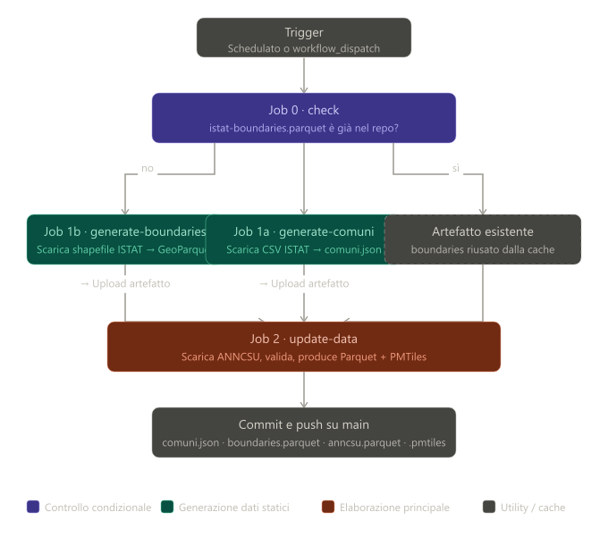

# ANNCUS

## Flusso di lavoro principale [anncsu-viewer di  Geobeyond Srl ](https://anncsu-open.github.io/anncsu-viewer/)

## [Web App - Analisi Numeri Civici ANNCSU – Italia](https://gbvitrano.github.io/ANNCSU/)
    
## Dati by @opendatasicilia 

[anncsu-indirizzi.parquet](https://media.githubusercontent.com/media/quattochiacchiereinquattro/anncus/main/data/anncsu-indirizzi.parquet)

[anncsu-indirizzi.pmtiles](https://media.githubusercontent.com/media/quattochiacchiereinquattro/anncus/main/data/anncsu-indirizzi.pmtiles)

[istat-boundaries.parquet](https://media.githubusercontent.com/media/quattochiacchiereinquattro/anncus/main/data/istat-boundaries.parquet)

[comuni.json](https://raw.githubusercontent.com/quattochiacchiereinquattro/anncus/refs/heads/main/data/comuni.json)

---

  

---

Il workflow GitHub Actions si articola in quattro job eseguiti in sequenza, con un meccanismo di parallelismo parziale nei passaggi intermedi.

**Job 0 – Controllo prerequisiti.** Ad ogni esecuzione, il workflow verifica in primo luogo se il file `istat-boundaries.parquet` è già presente nel repository. Poiché i confini amministrativi comunali cambiano raramente, rigenera il file solo in caso di assenza o quando l'operatore lo richiede esplicitamente tramite l'input `regenerate_boundaries`. Se il file esiste, viene immediatamente pubblicato come artefatto temporaneo per renderlo disponibile ai job successivi senza ricalcolo.

**Job 1a e 1b – Generazione dati statici (paralleli).** I due job partono contemporaneamente dopo il job 0. `generate-comuni` scarica il CSV ISTAT dei comuni italiani (encoding latin-1, separatore `;`), normalizza i codici ISTAT a 6 cifre e produce `comuni.json`. `generate-boundaries`, eseguito solo se necessario, scarica lo shapefile ISTAT non generalizzato (~2025), lo carica in DuckDB con l'estensione spatial, riproietta le geometrie in WGS84, corregge i poligoni invalidi con `shapely.make_valid` e chiude i gap topologici tra comuni adiacenti con `shapely.snap`, escludendo i gap marini legittimi. L'output è un GeoParquet compresso ZSTD.

**Job 2 – Elaborazione principale.** Una volta disponibili entrambi gli artefatti, viene eseguito `update_data.py`, che scarica il dataset ANNCSU, lo valida rispetto ai confini comunali e produce `anncsu-indirizzi.parquet`. Se non disabilitata, viene avviata anche la conversione in formato PMTiles tramite `tippecanoe`. Un file marker `.last_remote_date`, conservato in cache tra un'esecuzione e l'altra, consente di saltare il re-download quando la fonte non ha subito aggiornamenti.

**Commit finale.** Tutti i file prodotti — `comuni.json`, `istat-boundaries.parquet`, `anncsu-indirizzi.parquet`, `.pmtiles` e il marker di data — vengono committati sul branch principale con messaggio datato e trasmessi al repository tramite push.

Il workflow è configurato per girare automaticamente alcune volte al mese (via cron) e può essere avviato manualmente con opzioni per forzare il re-download, rigenerare i boundaries o saltare la produzione dei PMTiles.
